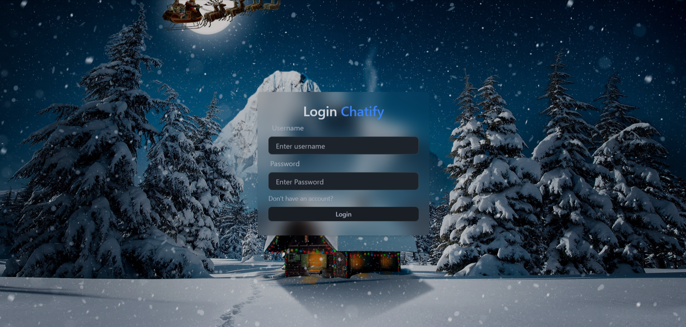
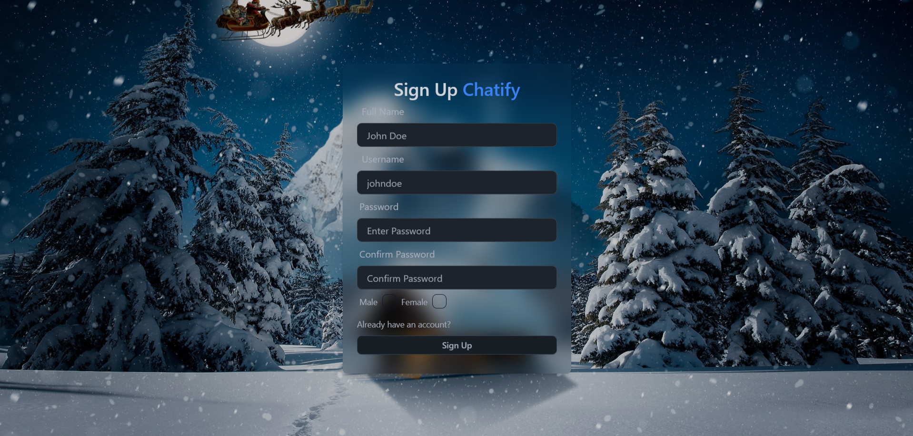
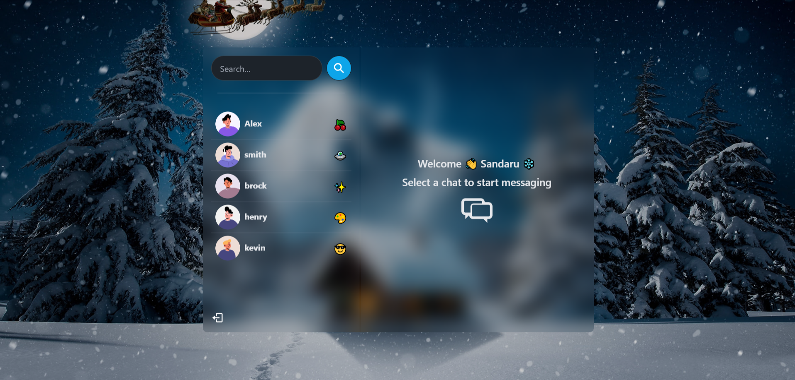
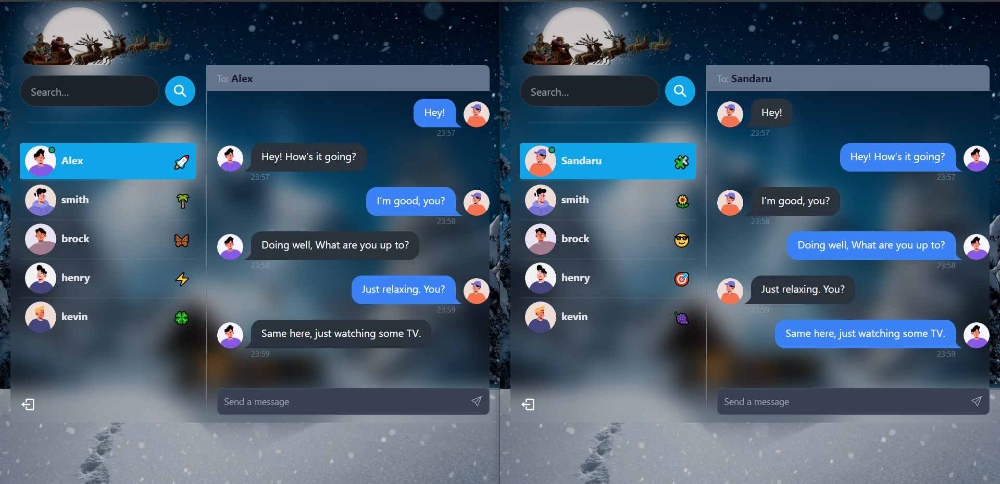

<p align="center">
  
  
</p>
<p align="center">
  
  
</p>


# [Real-time Chat Application](#real-time-chat-application)

## 📋 [Table of Contents](#table-of-contents)

1. 🤖 [Introduction](#introduction)
2. ⚙️ [Tech Stack](#tech-stack)
3. 🔋 [Features](#features)
4. 🤸 [Quick Start](#quick-start)

## 🤖 [Introduction](#introduction)

This real-time chat application is built with the MERN stack and uses Socket.io for real-time communication. It supports user authentication, online status indicators, search functionality, and plays iOS-style notification sounds for incoming messages. The application provides a seamless experience for users to chat in real time with online indicators and smooth UI interactions.

## ⚙️ [Tech Stack](#tech-stack)

- **Frontend**: React.js with TailwindCSS
- **Backend**: Node.js with Express
- **Database**: MongoDB
- **Real-time Communication**: Socket.io
- **State Management**: Zustand

## 🔋 [Features](#features)

👉 **User Authentication**: Secure login and signup using JWT for authentication.

👉 **Real-time Messaging**: Users can send and receive messages in real-time using Socket.io.

👉 **Online Status**: Users can see if others are online with an indicator showing online status.

👉 **User Search**: Search for other users in the app to start chatting.

👉 **Notification Sounds**: iOS-style notification sound plays when a new message is received.

👉 **Responsive UI**: Built with TailwindCSS, the app works seamlessly across all screen sizes.

👉 **Error Handling**: Comprehensive error handling on both server and client sides.

## 🤸 [Quick Start](#quick-start)

1. **Clone the repository**:

   ```bash
   git clone https://github.com/vidmal001/Full-Stack-Chat-Application.git
   ```

2. **Navigate to the frontend folder**:

   ```bash
   cd frontend
   ```

3. **Install the frontend dependencies**:

   ```bash
   npm install
   ```

4. **Go back to the root directory**:

   ```bash
   cd ..
   ```

5. **Install the backend dependencies**:

   ```bash
   npm install
   ```

6. **Set up environment variables**:

   **Server Side (.env)**:

   - Create a file named `.env` in the `server` folder.
   - Add the following:
     ```env
     PORT= 5000
     MONGO_DB_URI= your_mongo_uri
     JWT_SECRET= your_secret_key
     NODE_ENV= development
     ```

7. **Run the client**:

   ```bash
   cd frontend && npm run dev
   ```

8. **Run the backend**:
   ```bash
   npm run dev
   ```

Now, the application should be running, and you can access it at [http://localhost:3000](http://localhost:3000).
